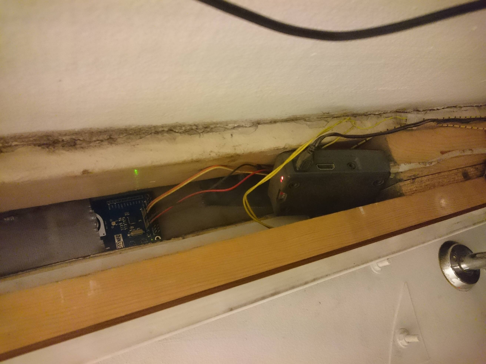

# door

GPIO door lock control

- Tested on a Pi Zero W running Raspbian GNU/Linux 9
- The Pi should be powered with an adapter rated between 5.1V - 5.2V, 2.5A
- The card readers tested are of the type PN532
- The door lock is triggered by raising a single GPIO pin
- Pins are numbered using the [wiringPi scheme][1]
- The cardreader is assumed connected with I²C on interface #1 (the lowest I²C pin numbers)
- Authorized card numbers are downloaded from hackerhula



## Wiring

Schematics of the circuit can be found in [/schematics](/schematics) which have been
created with [`gschem`][gschem].

## Installation

Install dependencies

    # apt install wiringpi libnfc5 libnfc-dev build-essential

Build `nfcreader`

    $ cd nfcreader
    $ make

Enable I²C interface

    # echo 'dtparam=i2c_arm=on' >> /boot/config.txt

Specify where the NFC device can be found by libnfc

    # echo 'device.connstring = "pn532_i2c:/dev/i2c-1"' > /etc/nfc/libnfc.conf

Copy systemd service file to system folder

    # cp doord.service /etc/systemd/system

Set password to upstream card list in environment variable

    # vim /etc/systemd/system/doord.service

Reload, enable and start the service

    # systemctl daemon-reload && systemctl enable doord.service && systemctl start doord.service

Reboot!

## Usage

Trigger door lock

```
$ GPIO_PIN_DOOR=0 STAY_UNLOCKED_SEC=2 open-door
```

## Trigger lock over network

### SSH

Connect with SSH from the local network and use the password stored from hackerpass `infrastructure/hackeriet-door-trigger`.
The shell of the `entry` user is the `open-door` script. Connect with caution.

```
$ ssh entry@10.0.20.10
```

### Web interface

> **NOTE** Up to date information about this functionality can be found in https://github.com/hackeriet/door-remote

https://door-remote.hackeriet.no

## Developing

See [/test/run-test.sh](/test/run-test.sh) to see how to use mocks in `doord.py`.
The test script currently has to be run from the project root to get correct paths.

## Debugging and Troubleshooting

### Things to check

- Make sure wiring is correct. Easy to mix up CLOCK and DATA wires when connecting the I²C device.
- Measure output voltage on the 5V rail. If it's below 5 volts, the card readers may malfunction.
- Make sure the power rating of the power supply is as high as expected (see first section of this document)

### Helpful binaries

- To debug the I²C interface, `i2c-tools` contains some nice utils. Specifically `i2cdetect` which dumps all addresses found on the I²C bus (`i2cdetect -y 1` for bus number 1)
- `libnfc-bin` and `libnfc-examples` contains some libnfc utilities. Specifically `nfc-poll` and `nfc-scan-devices` are helpful in detecting a correctly connected nfc device

### Verify daemon is running as it should

    # journalctl -u doord.service -f

## Thanks to

- jonnor, Mathsterk @trygvis from #bitraf @ chat.freenode.org for wiring advice

## References

- [wiringPi wiring scheme][1]
- [The `gpio` utility][2]
- [Bash exit traps][3]
- [Power a 5V relay from GPIO pins](https://raspberrypi.stackexchange.com/questions/27928/power-a-5v-relay-from-gpio-pins#28201)
- [Logging in Systemd](https://www.loggly.com/blog/logging-in-new-style-daemons-with-systemd/)

[1]: https://pinout.xyz/pinout/wiringpi
[2]: https://projects.drogon.net/raspberry-pi/wiringpi/the-gpio-utility/
[3]: http://redsymbol.net/articles/bash-exit-traps/
[gschem]: https://wiki.archlinux.org/index.php/GEDA
